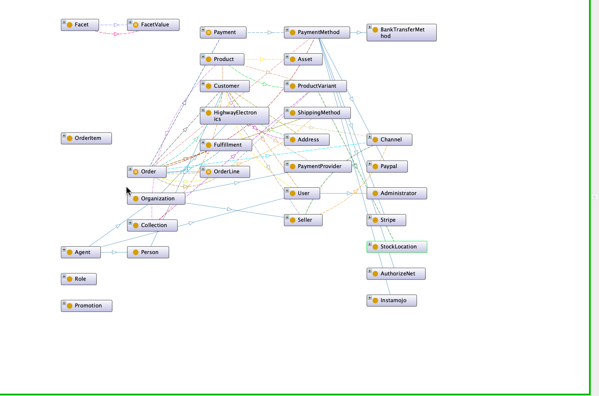

# E-commerce Model based on Vendure

An OWL ontology describing the world of multi-seller online shops for electronic parts, based on the structure of the [Vendure commerce system](https://vendure.io/).

## Features

* Shows the main things in e-commerce (like products, orders, customers) and how they connect, following Vendure's design.
* It includes detailed ideas about the products you can buy, like different versions (`ProductVariant`) and how they are grouped (`Collection`, `Facet`, `Asset`).
* It shows how orders are made up of specific items (`OrderLine`).
* It covers how payments are handled (`Payment`, `PaymentMethod`) and how addresses work (`Address` types).
* It shows how shipping is implemented (`Fulfillment`, `ShippingMethod`).
* It includes the idea of 'Channels' from Vendure (for different shops/sellers). It shows how things are connected to these channels using a special type of link.
* You can find the model in a standard format called RDF/XML.

### Key Classes (Main Groups of Things):

* `Agent` (A type of `owl:Thing` that can do things)
    * `Organization` (A type of Agent: `HighwayElectronics`, `Seller`, `PaymentProvider`)
    * `Person` (A type of Agent: `Customer`)
    * `User` (A type of Agent: `Customer`, `Administrator`)
* `Product` (A type of `owl:Thing`)
* `ProductVariant` (A type of `owl:Thing`)
* `Collection` (A type of `owl:Thing`)
* `Facet`, `FacetValue` (Types of `owl:Thing` used for classifying)
* `Asset` (A type of `owl:Thing` like an image)
* `StockLocation` (A type of `owl:Thing`)
* `Address` (A type of `owl:Thing`)
    * `ShippingAddress` (A type of Address)
    * `BillingAddress` (A type of Address)
* `Order` (A type of `owl:Thing`)
    * `OrderLine` (A type of Order)
* `Payment` (A type of `owl:Thing`)
* `PaymentMethod` (A type of `owl:Thing`)
    * (`Instamojo`, `Stripe`, `AuthorizeNet`, `Paypal`, `BankTransferMethod` are types of `PaymentMethod`)
* `Channel` (A type of `owl:Thing`)
* `Fulfillment` (A type of `owl:Thing`)
* `ShippingMethod` (A type of `owl:Thing`)
* `Promotion` (A type of `owl:Thing`)
* `Role` (A type of `owl:Thing`)

### Key Object Properties (Main Relationships Between Things):

* `hasVariant` (Connects a Product to a ProductVariant)
* `refersToVariant` (Connects an OrderLine to a ProductVariant)
* `containsItem` (Connects an Order to an OrderLine)
* `hasShippingAddressDetails` (Connects an Order to its ShippingAddress)
* `hasBilingAddressDetails` (Connects an Order to its BillingAddress)
* `hasPayment` (Connects an Order to its Payment)
* `ussPaymentMethod` (Connects a Payment to a PaymentMethod)
* `hasSelectedShippingMethod` (Connects an Order to the chosen ShippingMethod)
* `hasSelectedPaymentMethod` (Connects an Order to the chosen PaymentMethod)
* `isFulfilledBy` (Connects an Order to a Fulfillment)
* `handledByShippingMethod` (Connects a Fulfillment to a ShippingMethod)
* `managedBySeller` (Connects a Channel to a Seller)
* `managesChannelOnPlatform` (Connects HighwayElectronics to a Channel)
* `belongsToChanel` (Connects different e-commerce things like Product, Orders, Customers to a Channel)
* `hasCollection` (Connects a Product to a Collection)
* `includesVariant` (Connects a Collection to a ProductVariant)
* `includesProduct` (Connects a Collection to a Product)
* `hasFacetValue` (Connects different e-commerce things to a FacetValue)
* `hasAsset` (Connects a Product to an Asset)
* `availableAtStockLocation` (Connects a ProductVariant to a StockLocation)
* `associatedWithUser` (Connects a Customer to a User)
